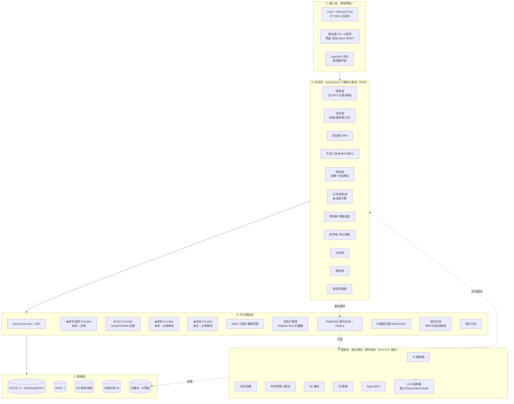
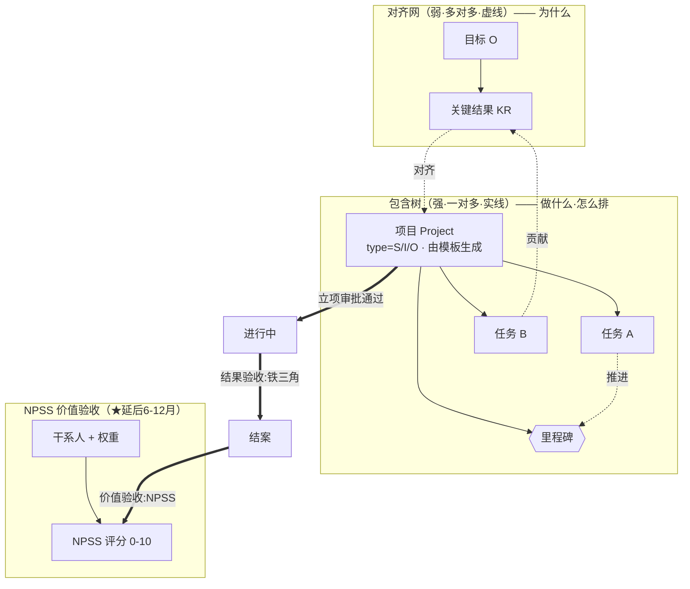
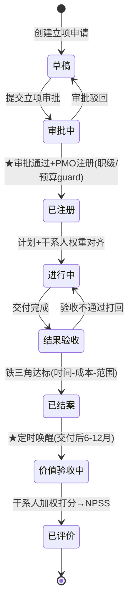
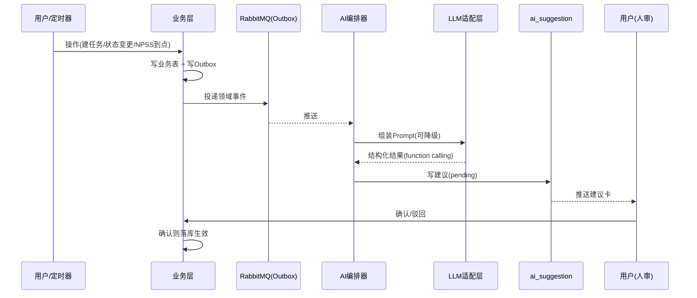
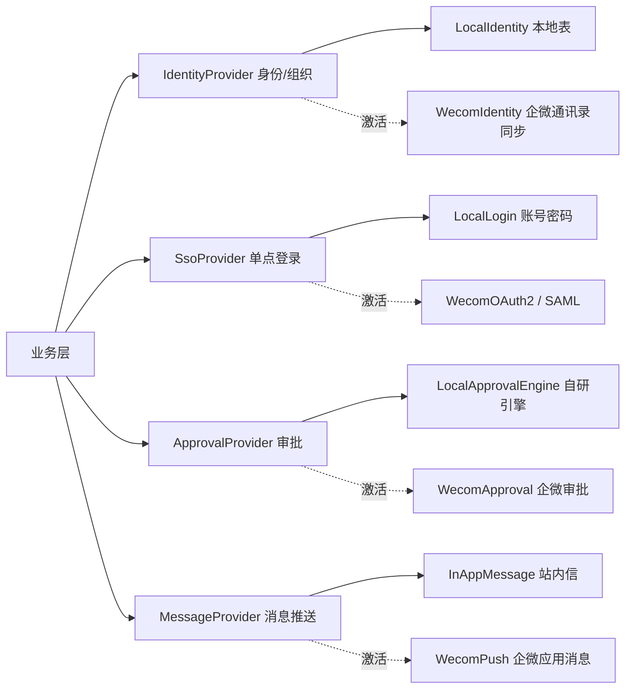

# 米多通用项目管理系统 · 整体设计与实现方案 v3

> 目标客户：通用业务中小团队 ｜ 对标：Worktile 全功能 ｜ 战略：**预留扩展 · 先自用再商用 · 先夯实基础再接入智能**
> 范围：米多**业务侧**项目管理（区别于研发管理，研发继续用 TAPD）
> v3 变更（相对 v2）：①系统性吸收《Worktile 调研》的信息架构与交互逻辑；②**立项审批升级为一等流程引擎（严肃场景）**；③补齐**多端预留**与 **SSO/企微四 Provider 抽象**；④新增**项目模板**（含米多 5 套内置模板）；⑤产出配套《设计系统 design-system.md》统一前端一致性；⑥扩充 DDL（审批、模板、工时、费用、文档、评论、通知、视图、数据范围、身份映射）。
> 配套文档：`docs/design-system.md`（前端事实源）、`docs/data-model.md`（DDL 事实源）、`docs/npss-rule.md`（算分规则）、`docs/api-conventions.md`、`docs/domain-events.md`。

---

## 0. 设计总纲

### 0.1 三条策略 → 架构落点

| 策略 | 架构落点 | 关键设计 |
|---|---|---|
| **预留扩展** | 模块化单体 + 事件驱动 + 能力插件化 | DDD 限界上下文；RabbitMQ 事件总线；智能层只订阅事件不侵入业务；ShardingSphere 预埋分片；**四 Provider 接口（身份/组织、SSO、审批、消息）从第一天抽象** |
| **先自用再商用** | 单租户部署起步，多租户座位预埋 | 所有业务表第一天带 `tenant_id`；隔离用 MyBatis-Plus 拦截器统一注入；多端（PC/H5/小程序/OpenAPI）走同一套 REST 契约；商用期"激活"而非改表 |
| **先夯实基础再接入智能** | 业务层与智能层物理解耦 | 业务层零 AI 依赖即闭环；AI 订阅领域事件、回写 `ai_suggestion`（人审）；LLM 适配层可插拔 |

### 0.2 NPSS 带来的三个设计原则（核心护城河）

读完规范后必须把握：**NPSS（Net Project Success Score）不是阶段方法论，而是一套"交付后 6–12 个月、由加权干系人打分"的价值验收标准。** 它把"项目成功"从"按时按预算交付"重新定义为"交付价值是否值得投入（Value > Effort + Expense）"。三处硬性影响：

1. **项目生命周期是"两段式验收 + 延后触发"**，不能在"已结案"终止——必须有结果验收（铁三角）→ 价值验收（NPSS，延后 6–12 月）两道关，系统要能在结案后定时唤醒 NPSS 评分流程。
2. **干系人（Stakeholder）是一等公民**，不是项目成员的子集——NPSS 由加权干系人打分，权重在立项阶段按项目类型对齐。系统必须建干系人、权重、评分三类数据。
3. **AI 的差异化锚点是 M.O.R.E. 框架**——风险预警不止看逾期，更服务"持续重估价值(R)""管理干系人价值认知(M)"。这让我们的 AI 比 Worktile 类通用工具更锐利。

### 0.3 借鉴 Worktile 的设计取舍（吸收什么 / 改进什么）

| Worktile 能力 | 我们的态度 | 落点 |
|---|---|---|
| 左导航 + 工作台 + 项目/目标/审批/报表 信息架构 | **直接吸收** | 见 §1.2、design-system §4 |
| 多视图（看板/列表/表格/甘特/日历/仪表盘）+ 视图设计器 | **直接吸收** | `pm_view`，design-system §6 |
| 任务详情：信息 Tab + 右侧"评论/活动/流转/状态审批" | **直接吸收** | 详情抽屉范式 design-system §7 |
| 工时管理（预估/实际/工时类别/汇总） | **吸收** | `pm_work_hour` |
| 费用管理（预算/执行/财务科目/审批退回） | **吸收**（并与预算绑定机制打通） | `pm_cost` |
| 任务依赖、里程碑标记、循环规则、自定义可见范围 | **吸收** | `pm_task_dependency`、`is_milestone`、`recur_rule` |
| 角色管理：功能权限 + **数据范围**（本人/本部门/及下属/全部/自定义） | **吸收**（企业级权限基线） | `sys_role_data_scope` |
| 审批应用：表单设计器 + 固定/自由/条件分支流程 + 审批人/知会人 | **吸收并升级为立项审批引擎** | §1.4、`approval_*` |
| 企微/飞书/钉钉/LDAP/OAuth2/SAML 组织同步与 SSO | **吸收为 Provider 抽象**（先本地，后激活企微） | §6 |
| 工作台卡片只能逐个添加、排版粗糙 | **改进**：卡片分组批量添加 + 模板化布局 | design-system §7-C |
| 无干系人体系、无价值（NPSS）验收 | **超越**：这是我们的护城河 | §2、§3 |

---

## 1. 整体架构分层



### 1.1 技术栈（严格对齐 02-技术栈 v1.1，不另选）

| 层 | 选型 | 锁定来源 |
|---|---|---|
| 后端 | Java 17 LTS + Spring Boot 3.x + Spring MVC | 已锚定 |
| 安全 | Spring Security + JWT | 已锚定 |
| ORM | MyBatis-Plus 3.x（含代码生成） | 已锚定 |
| 数据库 | MySQL 8.0 + HikariCP | 已锚定 |
| 缓存 | Redis 7.x | 已锚定 |
| 消息队列 | RabbitMQ 3.x（事件驱动主通道） | 已锚定 |
| 分库分表 | ShardingSphere 5.x（多租户/分片预埋） | 已锚定 |
| 对象存储 | S3 兼容（私有 MinIO / 云 OSS-COS） | 已锚定 |
| 工具/校验/文档 | Jackson、Hutool、Hibernate Validator、Swagger/OpenAPI 3.0 | 已锚定 |
| 前端 | Vue 3 + Element Plus + Pinia + Vue Router 4 + Vite + Axios | 已锚定 |
| 前端可视化 | AntV G2/G6（甘特/关系图）+ vuedraggable（看板） | 信创友好 |
| 部署 | Docker + Docker Compose（自用）→ K8s（商用） | 已锚定 |

### 1.2 信息架构（IA · 直接吸收 Worktile）

- **左侧主导航**（深色）：工作台 / 项目 / 目标 / 审批 / 报表 / 文档 / 管理后台。
- **项目模块二级导航**：我的任务 / 全部项目 / 立项审批 / 统计分析 / 报表。
- **单项目内部 Tab**（组件可增删，对齐 Worktile 项目组件管理）：项目概览（默认）/ 任务管理 / 甘特图 / 目标管理 / 干系人 / 验收(NPSS) / 费用管理 / 工时统计 / 数据报表 / 项目文件。
- **详情**：一律右侧抽屉，左信息 Tab + 右活动栏（评论/活动/流转/状态审批），不整页跳转。

### 1.3 多端策略（先 PC，预留 H5/小程序/OpenAPI）

第一天即定的硬约定：**所有能力以 REST + OpenAPI 契约暴露，前端是契约的消费者之一**。PC Web 为主战场；H5/小程序后续复用同一套 REST 接口 + design-system token 体系，仅重写视图层；商用期开放 OpenAPI 网关（鉴权独立、限流、版本化 `/api/v1`）。后端**不得**为 PC 写专用接口逻辑，避免多端分叉。

### 1.4 立项审批引擎（严肃场景 · 升级版）

规范要求"强制立项注册 + 预算绑定 + 分级分类监管"。Worktile 的审批能力（表单设计器、固定/条件分支流程、审批人/知会人）被吸收并升级为**立项审批的一等流程引擎**：

- **立项申请单**：按 S/I/O 类型动态表单（项目目标、预算、Leader、干系人初稿、价值假设）。
- **审批流定义**：支持固定流程、条件分支（按金额/类型/职级自动选流）、会签/或签、知会人。
- **职级门槛 guard**：S→Leader 必须 L3+，O→L2+，在审批节点强校验，不满足直接拦截。
- **严肃约束**：**未通过立项审批的项目不得进入"进行中"执行态**（状态机 guard）；预算在立项时绑定，后续超支触发预警。
- **可视化设计器** `ApprovalFlowDesigner`：PMO 可配置不同项目类型的审批流，无需改代码。

---

## 2. 核心数据模型

延续既定决策：**plan 不单独建实体**（计划=任务沿时间轴排布）；**milestone 默认作为 task 标记位**；**目标不挂在执行树上**。v3 在 v2（项目分类 S/I/O、干系人体系、两段式验收+NPSS）基础上补齐 Worktile 同级能力（工时、费用、依赖、视图、数据范围、审批引擎、模板、协作）。完整 DDL 见 `docs/data-model.md`，此处给关系与关键表。

### 2.1 双结构 + NPSS 验收的整体关系



### 2.2 项目生命周期状态机（立项审批 + 两段式验收）



关键：①**"审批中→已注册"是严肃闸门**，未通过不得执行；②**"已结案"不是终点**，定时任务在交付后 6–12 个月（长周期项目按里程碑）自动把项目推入"价值验收中"。这两点是本系统区别于 Worktile 的结构性能力。

### 2.3 DDL 关键表（公共字段 tenant_id/create_by/create_time/update_time/is_deleted 略；完整版见 docs/data-model.md）

```sql
-- 【项目：计划容器 + S/I/O 分类 + 模板来源 + 双段验收 + 预算绑定】
CREATE TABLE pm_project (
  id BIGINT PRIMARY KEY, tenant_id BIGINT NOT NULL,
  code VARCHAR(64), name VARCHAR(128) NOT NULL, description TEXT,
  category VARCHAR(8) NOT NULL,            -- S战略 / I创新 / O运营
  sub_category VARCHAR(16),                -- O细分: 常规运营/定向整改/专项督办
  template_id BIGINT,                      -- ★来源项目模板
  leader_id BIGINT,                        -- Leader(职级校验 S→L3+ / O→L2+)
  status VARCHAR(32), workflow_id BIGINT,
  start_date DATE, end_date DATE,
  budget DECIMAL(14,2), actual_cost DECIMAL(14,2),
  value_review_due_date DATE,              -- ★NPSS应启动日(结案+6~12月)
  pmo_registered_at DATETIME, archived TINYINT DEFAULT 0,
  KEY idx_tenant(tenant_id), KEY idx_cat(category), KEY idx_review(value_review_due_date)
);

-- 【项目模板：内置米多 5 套 + 可自定义】
CREATE TABLE pm_project_template (
  id BIGINT PRIMARY KEY, tenant_id BIGINT, name VARCHAR(64), category VARCHAR(8),
  sub_category VARCHAR(16), description TEXT, is_builtin TINYINT DEFAULT 0,
  config JSON                              -- 阶段/任务模板/默认干系人权重/默认审批流/默认字段
);

-- 【任务：自关联拆子任务 + 里程碑 + 循环 + 工时】
CREATE TABLE pm_task (
  id BIGINT PRIMARY KEY, tenant_id BIGINT NOT NULL, project_id BIGINT NOT NULL,
  parent_id BIGINT DEFAULT 0, title VARCHAR(256) NOT NULL, description TEXT,
  assignee_id BIGINT, status VARCHAR(32), priority TINYINT, stage VARCHAR(32), -- 项目阶段
  start_date DATE, due_date DATE, is_milestone TINYINT DEFAULT 0,
  recur_rule JSON,                         -- 循环规则(按天/周/月/年)
  est_hours DECIMAL(8,2), actual_hours DECIMAL(8,2),
  custom_fields JSON, ai_source VARCHAR(32) DEFAULT 'human',
  KEY idx_proj(project_id), KEY idx_assignee(assignee_id), KEY idx_tenant(tenant_id)
);
CREATE TABLE pm_task_dependency (
  id BIGINT PRIMARY KEY, tenant_id BIGINT, predecessor_id BIGINT, successor_id BIGINT,
  type VARCHAR(8) DEFAULT 'FS', KEY idx_pre(predecessor_id), KEY idx_suc(successor_id)
);

-- 【工时（吸收 Worktile：预估/实际/类别/汇总）】
CREATE TABLE pm_work_hour (
  id BIGINT PRIMARY KEY, tenant_id BIGINT, task_id BIGINT, user_id BIGINT,
  kind VARCHAR(8),                         -- est预估 / actual实际
  category VARCHAR(16),                    -- 设计/研发/文档/测试/其他
  work_date DATE, hours DECIMAL(8,2), remark VARCHAR(200), KEY idx_task(task_id)
);

-- 【费用（吸收 Worktile + 预算绑定）】
CREATE TABLE pm_cost (
  id BIGINT PRIMARY KEY, tenant_id BIGINT, project_id BIGINT, title VARCHAR(128),
  account VARCHAR(32),                     -- 财务科目:住宿/餐费/差旅/制作/服务费...
  budget_amount DECIMAL(14,2), actual_amount DECIMAL(14,2),
  occur_date DATE, pay_date DATE, status VARCHAR(16), -- 未发生/已发生/被退回
  approval_id BIGINT, KEY idx_proj(project_id)
);

-- 【目标/KR：自成体系】
CREATE TABLE pm_goal (
  id BIGINT PRIMARY KEY, tenant_id BIGINT, title VARCHAR(256), type VARCHAR(16),
  parent_id BIGINT DEFAULT 0, owner_id BIGINT, period VARCHAR(32),
  metric_unit VARCHAR(16), metric_start DECIMAL(14,2), metric_target DECIMAL(14,2),
  metric_current DECIMAL(14,2), progress DECIMAL(5,2) DEFAULT 0, KEY idx_tenant(tenant_id)
);
CREATE TABLE pm_goal_alignment (
  id BIGINT PRIMARY KEY, tenant_id BIGINT, goal_id BIGINT,
  target_type VARCHAR(16), target_id BIGINT, KEY idx_goal(goal_id)
);

-- 【★干系人：NPSS 一等公民 + 权力利益矩阵】
CREATE TABLE pm_stakeholder (
  id BIGINT PRIMARY KEY, tenant_id BIGINT, project_id BIGINT NOT NULL,
  user_id BIGINT, external_name VARCHAR(128),
  role VARCHAR(32),                        -- sponsor/business/team/finance/regulator/other
  category VARCHAR(16),                    -- internal / external
  power_level TINYINT, interest_level TINYINT,  -- 权力/利益 1-5
  npss_weight DECIMAL(5,2),                -- ★NPSS权重(立项对齐)
  KEY idx_proj(project_id)
);

-- 【★NPSS 评分】
CREATE TABLE pm_npss_review (
  id BIGINT PRIMARY KEY, tenant_id BIGINT, project_id BIGINT NOT NULL,
  round VARCHAR(32), status VARCHAR(16),   -- pending/scoring/done
  weighted_score DECIMAL(5,2), result_level VARCHAR(16), -- success/mixed/failure
  reviewed_at DATETIME, KEY idx_proj(project_id)
);
CREATE TABLE pm_npss_score (
  id BIGINT PRIMARY KEY, tenant_id BIGINT, review_id BIGINT NOT NULL,
  stakeholder_id BIGINT NOT NULL, score TINYINT, weight DECIMAL(5,2), comment TEXT,
  KEY idx_review(review_id)
);

-- 【★立项/审批引擎（吸收并升级 Worktile 审批）】
CREATE TABLE approval_form (         -- 表单定义(设计器产出)
  id BIGINT PRIMARY KEY, tenant_id BIGINT, name VARCHAR(64), biz_type VARCHAR(32), schema JSON);
CREATE TABLE approval_flow (         -- 流程定义
  id BIGINT PRIMARY KEY, tenant_id BIGINT, name VARCHAR(64), biz_type VARCHAR(32),
  mode VARCHAR(16),                       -- fixed固定/free自由/conditional条件
  definition JSON);                       -- 节点/条件/审批人/知会人/会签或签
CREATE TABLE approval_instance (     -- 流程实例
  id BIGINT PRIMARY KEY, tenant_id BIGINT, flow_id BIGINT, biz_type VARCHAR(32),
  biz_id BIGINT, status VARCHAR(16),      -- pending/approved/rejected
  current_node VARCHAR(64), form_data JSON, applicant_id BIGINT);
CREATE TABLE approval_task (         -- 审批节点待办
  id BIGINT PRIMARY KEY, tenant_id BIGINT, instance_id BIGINT, node VARCHAR(64),
  approver_id BIGINT, action VARCHAR(16), comment TEXT, acted_at DATETIME);

-- 【可配置工作流(对标 Worktile 自定义状态流，可按 S/I/O 绑不同流)】
CREATE TABLE pm_workflow (id BIGINT PRIMARY KEY, tenant_id BIGINT, name VARCHAR(64), apply_to VARCHAR(16), category VARCHAR(8));
CREATE TABLE pm_workflow_status (id BIGINT PRIMARY KEY, workflow_id BIGINT, code VARCHAR(32), name VARCHAR(32), category VARCHAR(16), sort INT);
CREATE TABLE pm_workflow_transition (id BIGINT PRIMARY KEY, workflow_id BIGINT, from_status VARCHAR(32), to_status VARCHAR(32), guard_role VARCHAR(64));

-- 【视图配置(同数据多视图)】
CREATE TABLE pm_view (
  id BIGINT PRIMARY KEY, tenant_id BIGINT, scope VARCHAR(16), owner_id BIGINT,
  type VARCHAR(16),                       -- kanban/list/table/gantt/calendar/dashboard
  config JSON);                           -- 分组/排序/层级/筛选/列字段

-- 【自定义字段(EAV)】
CREATE TABLE pm_field_def (id BIGINT PRIMARY KEY, tenant_id BIGINT, scope VARCHAR(16), name VARCHAR(64), type VARCHAR(32));
CREATE TABLE pm_field_value (id BIGINT PRIMARY KEY, field_id BIGINT, entity_type VARCHAR(16), entity_id BIGINT, value TEXT);

-- 【协作：评论 / 通知 / 附件】
CREATE TABLE pm_comment (id BIGINT PRIMARY KEY, tenant_id BIGINT, entity_type VARCHAR(16), entity_id BIGINT, user_id BIGINT, content TEXT, mention JSON, create_time DATETIME);
CREATE TABLE pm_notification (id BIGINT PRIMARY KEY, tenant_id BIGINT, user_id BIGINT, type VARCHAR(32), title VARCHAR(128), payload JSON, is_read TINYINT DEFAULT 0, channel VARCHAR(16)); -- channel: inapp/wecom
CREATE TABLE pm_attachment (id BIGINT PRIMARY KEY, tenant_id BIGINT, entity_type VARCHAR(16), entity_id BIGINT, name VARCHAR(256), oss_key VARCHAR(512), size BIGINT);

-- 【组织/权限：RBAC + 数据范围 + 身份映射(SSO/企微预留)】
CREATE TABLE sys_user (id BIGINT PRIMARY KEY, tenant_id BIGINT, username VARCHAR(64), name VARCHAR(64), dept_id BIGINT, job_level VARCHAR(8), status VARCHAR(16));
CREATE TABLE sys_dept (id BIGINT PRIMARY KEY, tenant_id BIGINT, name VARCHAR(64), parent_id BIGINT DEFAULT 0);
CREATE TABLE sys_role (id BIGINT PRIMARY KEY, tenant_id BIGINT, name VARCHAR(64), code VARCHAR(64));
CREATE TABLE sys_role_perm (id BIGINT PRIMARY KEY, role_id BIGINT, perm_code VARCHAR(64));
CREATE TABLE sys_role_data_scope (id BIGINT PRIMARY KEY, role_id BIGINT, resource VARCHAR(32), scope VARCHAR(16)); -- self/dept/dept_and_sub/all/custom
CREATE TABLE sys_identity_map (   -- ★外部身份映射(企微 userid ↔ 本地 user)
  id BIGINT PRIMARY KEY, tenant_id BIGINT, user_id BIGINT, provider VARCHAR(16), external_id VARCHAR(128), KEY idx_ext(provider, external_id));

-- 【领域事件 Outbox(智能层/消息推送订阅源头)】
CREATE TABLE sys_domain_event (
  id BIGINT PRIMARY KEY, tenant_id BIGINT, event_type VARCHAR(64), payload JSON,
  status VARCHAR(16) DEFAULT 'pending', create_time DATETIME);

-- 【AI 建议 · 人在环(HITL)】
CREATE TABLE ai_suggestion (
  id BIGINT PRIMARY KEY, tenant_id BIGINT, type VARCHAR(32),  -- decompose/risk/report/agent_action/value_reassess
  ref_type VARCHAR(16), ref_id BIGINT, content JSON, status VARCHAR(16) DEFAULT 'pending', create_time DATETIME);
```

### 2.4 项目类型 → 默认 NPSS 权重模板（落规范"权力利益矩阵"）

立项时按项目类型预置默认权重，再由 Leader 与干系人对齐微调。算分细则见 `docs/npss-rule.md`。

| 项目类型 | 默认权重模板 | Leader 职级门槛 | 奖金规则 |
|---|---|---|---|
| 战略级 S | 发起人30% / 业务方30% / 团队10% / 财务10% / 其他20%（含管理层） | L3+ | 基数×价值系数×(满意度/100)，<60分归零 |
| 创新级 I | 同上可调（POC 类侧重业务方/发起人） | 不限职级 | 基数×价值系数×(满意度/100)，<60分归零 |
| 运营级 O·常规 | 业务使用部门50% / 管理层20% / 团队10% / 财务10% / 其他10% | L2+ | 基数×价值系数×(满意度/100)，<60分归零 |
| 运营级 O·定向整改 | 同内部业务模板 | L2+ | **无项目奖金** |
| 运营级 O·专项督办 | 监管/审计30% / 管理层30% / 业务20% / 团队10% / 其他10% | L2+ | **无项目奖金** |

铁律落进系统：**受益方（发起人/业务方）权重 ≥ 其他干系人 2 倍**（保存时硬校验）；满意度 <60 触发奖金归零硬校验。

---

## 3. 项目模板（内置米多 5 套，对齐规范 S/I/O）

立项时选模板，自动生成：阶段划分、任务清单骨架、默认干系人角色与权重、默认审批流、默认自定义字段。模板可由 PMO 维护扩展。

| 模板 | 适用 | 阶段（任务骨架） | 默认干系人权重 | 默认审批流 | 默认验收 |
|---|---|---|---|---|---|
| **战略级 S 标准** | IMP/MAP/EBC 等年度重点 | 立项→规划→执行(月度复盘)→结果验收→年度结案→NPSS | 发起人30/业务30/团队10/财务10/其他20 | 提交→部门负责人→PMO→分管副总→总经理 | 铁三角 + NPSS(强制) |
| **创新级 I · POC** | "一米宽十米深"探索/MTS 类 | 假设→POC 设计→验证→复盘 | 业务/发起人侧重，可调 | 提交→部门负责人→PMO | 铁三角 + NPSS |
| **运营级 O · 常规运营** | 米多星球/PDA 改造等攻坚 | 立项→执行→结果验收→NPSS | 业务部门50/管理20/团队10/财务10/其他10 | 提交→部门负责人→PMO | 铁三角 + NPSS |
| **运营级 O · 定向整改** | 部门月度总结"问题及对策"转化 | 问题确认→整改→验收 | 同内部业务模板 | 简化：提交→被协同部门确认→PMO | 铁三角（**无奖金**） |
| **运营级 O · 专项督办** | 管委会"基础素养处分"转化 | 立案→根治→督办验收 | 监管/审计30/管理30/业务20/团队10/其他10 | 提交→管委会指派→PMO | 铁三角（**无奖金**） |

> 模板是"先满足米多自身"的落点；商用期可让客户自建模板。模板配置存 `pm_project_template.config`(JSON)。

---

## 4. 功能模块与 Worktile 全功能对标 + 优先级

| 模块 | Worktile 对应 | P0 自用·夯基 | P1 自用·完善 | P2 商用·智能 | 数据模型 |
|---|---|---|---|---|---|
| 项目管理(S/I/O) | 项目 | ✅ 建项目/分类/生命周期/PMO注册 | 项目模板、预算绑定 | 多租户激活 | pm_project / template |
| 任务管理 | 任务 | ✅ 建任务/责任人/状态/子任务 | 依赖、里程碑、循环、工时、批量 | AI拆解/NL建单 | pm_task / dependency / work_hour |
| 多视图 | 看板/列表/表格/甘特/日历 | ✅ 看板+列表 | 表格+甘特+日历+视图设计器 | 仪表盘下钻 | pm_view |
| 工作流 | 自定义状态流 | ✅ 基础状态流 | 自定义字段+流转管控 | — | pm_workflow* |
| **★立项审批** | 审批应用 | ✅ 立项申请+固定流+职级guard | 表单设计器+条件分支+知会 | 流程开放 | approval_* |
| 费用管理 | 费用 | — | ✅ 预算/执行/科目/退回 + 预算绑定 | — | pm_cost |
| **★干系人管理** | （无） | ✅ 干系人登记+权力利益矩阵 | 权重模板+立项对齐 | AI 干系人认知预警(M) | pm_stakeholder |
| **★两段式验收/NPSS** | （无） | 结果验收(铁三角) | ✅ NPSS评分+延后触发+PMO汇总 | AI 价值重估(R) | pm_npss_* |
| 目标管理 | OKR | — | ✅ O-KR+对齐+量化指标 | 进度自动汇总 | pm_goal |
| 协作 | 评论/@/通知 | ✅ 评论+@+待办 | 企微通知推送 | — | pm_comment / notification |
| 文档/知识库 | 文档/网盘 | — | ✅ 项目内文档/附件 | AI摘要+经验复用 | pm_attachment |
| 报表/度量 | 度量/简报 | — | ✅ 燃尽/健康度/PMO看板 | AI日周报/预警 | ES聚合 |
| 组织权限 | 成员/角色/数据范围 | ✅ RBAC+数据范围+项目级隔离 | 部门/角色/企微同步 | 多租户隔离 | sys_* / identity_map |

> **★ 三个差异化模块（立项审批引擎 + 干系人管理 + NPSS 价值验收）= 本系统护城河。** 即便对标 Worktile 全功能，这三块也是我们超出它的地方。

**P0 闭环**：立项申请→审批通过(职级guard)→PMO 注册→建项目(S/I/O，选模板)→拆任务→看板/列表协作推进→RBAC+数据范围受控访问→干系人登记（为 NPSS 打地基）。

---

## 5. 智能层设计：先预留，后接入（锚定 M.O.R.E.）

### 5.1 解耦原则

业务侧只做一件事：领域行为发生时往 `sys_domain_event` 写事件 → 投递 RabbitMQ。智能层订阅、调 LLM、写 `ai_suggestion`，默认**人审确认后才生效**。第一阶段不接 AI 也能跑。



### 5.2 五项能力接入顺序 + M.O.R.E. 映射

| 顺序 | 能力 | 触发 | 输入→输出 | M.O.R.E. | 人审边界 | 阶段 |
|---|---|---|---|---|---|---|
| ① | 自然语言建单 | 用户输入 | "下周三前让小李做完物料采购"→任务JSON | — | 低·预览确认 | P1末 |
| ② | 自动日/周报 | 定时 | task流水→汇总报 | E 全局视野 | 低·可编辑 | P1末 |
| ③ | 任务自动拆解 | 用户对项目触发 | 目标→任务树草稿(可复用历史经验) | O 主导成功 | 中·逐条入库 | P2 |
| ④ | **风险预警** | 订阅排期/状态/NPSS事件 | 逾期/阻塞/**价值偏离**信号→研判→预警卡 | **R 持续重估 + M 价值认知** | 中·只提示 | P2 |
| ⑤ | Agent 自动执行 | 授权场景 | 多步→规划执行(改状态/派单/催办) | O 主导成功 | 高·强制HITL+可回滚+审计 | P2末 |

风险预警④是与 Worktile 拉开差距的关键：不只盯"任务逾期"，更服务 NPSS 的 **R（持续重估价值）**——当高权重干系人项目出现进度/成本偏离，或临近 NPSS 评价窗口时，提示"价值认知是否需要管理（M）"。这是 M.O.R.E. 数据显示能把 NPSS 从 27 拉到 94 的着力点。

### 5.3 LLM 适配层

统一 `LlmClient` 接口（chat / functionCall / embed），适配通义千问、DeepSeek、Claude，配置切换 + 主备降级。向量库第三阶段做 RAG（检索历史项目经验辅助拆解③、辅助预警④的价值重估）时启用——接口先留，实现后补。

---

## 6. SSO / 企微对接（四 Provider 抽象 · 先本地后激活）

你明确：后续通过 SSO 对接米多另一套系统，**统一用它的组织架构与人员（企微），甚至审批流、企微消息推送**。设计原则：**第一天就把四件事抽象成 Provider 接口，本地实现先跑通，企微实现后补、配置激活，不改业务代码。**



| Provider | 接口职责 | 阶段一实现 | 激活态实现 |
|---|---|---|---|
| `IdentityProvider` | 用户/部门/职级读取与同步 | 本地 sys_user/sys_dept | 企微通讯录拉取 + `sys_identity_map` 映射 |
| `SsoProvider` | 登录认证、换取本地 JWT | 本地账号密码 + JWT | 企微 OAuth2 / SAML2.0（对齐 Worktile SSO 能力） |
| `ApprovalProvider` | 提交/查询审批结果 | 本地审批引擎(§1.4) | 企微审批 API（保留双轨：可选本地或企微） |
| `MessageProvider` | 发送通知 | 站内信 pm_notification | 企微应用消息推送（按事件类型路由） |

**落地要点**：①审批/消息通过领域事件触发，Provider 是消费者，业务不直接耦合企微 SDK；②`sys_identity_map` 让企微 userid 与本地 user 解耦，组织变动只动映射；③SSO 激活后本地账号体系保留为降级通道。

---

## 7. 三阶段实施路线图

| | 阶段一·自用·夯基 | 阶段二·自用·完善+轻AI | 阶段三·商用·全AI |
|---|---|---|---|
| 目标 | 跑通最小闭环、替代语雀建档 | 补齐Worktile主体+NPSS闭环 | 对外商用+智能差异化 |
| 功能 | P0闭环+S/I/O+模板+立项审批+干系人登记+PMO注册 | 甘特/OKR/文档/费用/工时/通知/**NPSS评分+延后触发**+视图设计器 | 多租户/计费/开放平台 |
| AI | 不接,事件总线+suggestion表建好 | NL建单①、日/周报② | 拆解③、预警④(R+M)、Agent⑤ |
| 身份 | 本地账号(四Provider接口就位) | 仍本地，预演企微映射 | 激活企微SSO/同步/审批/推送 |
| 租户 | 单租户(tenant_id固定) | 仍单租户 | 激活多租户(ShardingSphere) |
| 部署 | Docker单机 | 单机/小集群 | K8s+信创适配 |
| 验收门 | 内部真实日活、PMO建档迁进系统 | NPSS评分流程在真实结案项目跑通 | 首批外部客户付费 |

每阶段的门：**上一阶段在米多内部被真实日活验证**才进下一阶段。阶段二必须验证 NPSS 评分流程能在真实结案项目上跑通——这是规范落地的硬指标。

---

## 8. 用 AI（Claude code web Agent）把它做出来

详细手把手与逐步 prompt 见配套《项目管理系统-构建指南.md》。核心打法：**围绕"单一事实源"批量生成、人做架构决策与审查。**

### 8.1 仓库与事实源

```
mido-pm/
├── CLAUDE.md                 # 技术栈(锁定)、分层约定、命名、禁止项、引用下列docs
├── docs/
│   ├── design-system.md      # ★前端视觉/交互事实源
│   ├── design-system-preview.html
│   ├── data-model.md         # 完整 DDL(含NPSS/干系人/审批/工时/费用/视图)
│   ├── npss-rule.md          # NPSS算分/权重模板/奖金硬校验
│   ├── api-conventions.md    # REST/CRUD/幂等/状态码/分页/多端契约
│   └── domain-events.md      # 事件清单(业务发布↔AI/消息订阅契约)
├── server/ (Spring模块化单体,按域分module)
└── web/    (Vue3按域分feature,引用 design-system)
```

### 8.2 "DDL/OpenAPI 即事实源"生成链路

```
DDL → Entity/Mapper(MyBatis-Plus生成器) → Service(领域逻辑+测试) → Controller(REST) → Swagger → Vue API层 → Vue页面(引用design-system)
```

### 8.3 三个提效杠杆

- **测试驱动**：让 AI 先写 Service 测试再写实现。NPSS 算分、权重归零、职级 guard、受益方权重校验必须有测试兜底。
- **Skill 化**：把"标准 CRUD 模块生成（Entity+Mapper+Service+Controller+Vue）"做成 skill，新模块一键起架子。
- **契约驱动**：`domain-events.md` + `api-conventions.md` 作为业务↔智能/消息层契约，AI 据此同时生成两端。

### 8.4 纪律

架构决策（限界上下文、双结构、NPSS 两段验收、四 Provider 边界、事件边界）由你定，不外包给 AI；AI 在既定架构内填充实现。每 2–3 模块用 `/compact` 压上下文、`/review` 审变更。

---

## 附：v3 相比 v2 的关键修正

1. **系统吸收 Worktile 设计逻辑**：补齐 IA、多视图+视图设计器、详情抽屉范式、工时、费用、依赖、里程碑、循环、角色数据范围、审批设计器，并改进其工作台不足。
2. **立项审批升级为一等流程引擎（严肃场景）**：未通过审批不得执行；职级/预算 guard；可视化流程设计器；条件分支。
3. **多端预留落到契约层**：REST+OpenAPI 单一契约，PC 先行，H5/小程序/OpenAPI 复用。
4. **SSO/企微四 Provider 抽象**：身份/组织、SSO、审批、消息推送先本地后激活，`sys_identity_map` 解耦。
5. **项目模板成型**：内置米多 5 套（S/I·POC/O·常规/O·定向整改/O·专项督办）。
6. **配套设计系统 + 脚手架事实源**：design-system.md/.html + data-model/npss-rule/api-conventions/domain-events，保障 AI 生成一致性。
