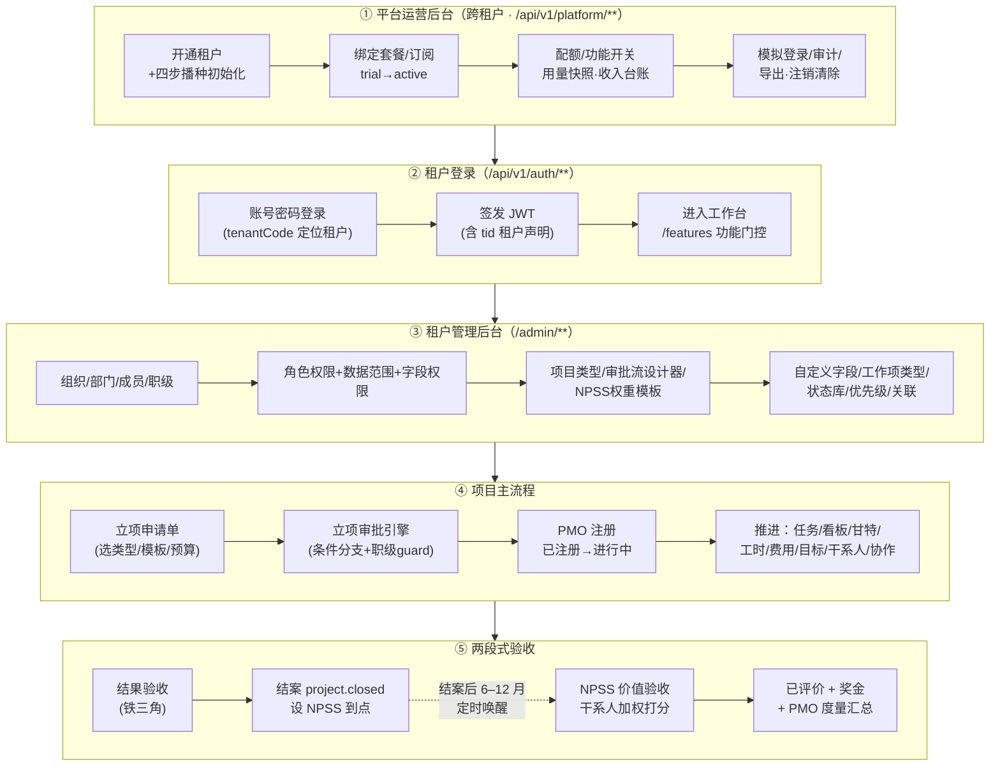
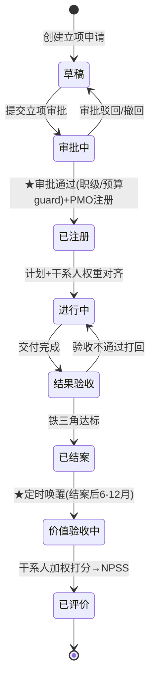

# 核心业务全流程主线（端到端地图）

> **用途**：这是一份「按真实使用顺序」串起整个系统的主线地图。从平台运营后台开通租户，到租户登录、配置、建项目、推进、验收、NPSS 价值评价，一条线走完。看完这一篇，应能建立对 mido-pm 的整体认知。
> **与其他文档的关系**：本文是「使用主线视角」，`architecture-overview.md` 是「设计架构视角」，`data-model.md` 是 DDL 事实源，`domain-events.md` 是事件契约，`npss-rule.md` 是算分规则。本文不重复抄 DDL / 接口全量，只串主线并指向落点（`文件:行`）。
> **闭环体检**见文末第 9 章；每条结论标注「已验证 / 推断 / 待复核」。

---

## 0. 全景图

### 0.1 端到端泳道全景

### 0.2 项目生命周期状态机

> 状态机落点：`server/module-project/.../domain/ProjectStateMachine.java:26-35`（状态集 + 合法流转矩阵，非法流转抛 `BizException`）。两道严肃闸门：①「审批中→已注册」未过审批不得执行；②「已结案」非终点，定时任务自动推入价值验收。

---

## 1. 阶段一 · 平台运营后台开通租户

**谁来做**：平台超管 / 运营（独立账号体系，种子 `superadmin / superadmin123`）。
**入口**：前端 `/ops/**`（`web/src/views/ops/*`），后端 `/api/v1/platform/**` + 独立 JWT 密钥（`PlatformTokenService`）。平台域是**跨租户全局域**，表不带 `tenant_id`。

### 1.1 核心功能

| 功能 | 前端页 | 后端落点 |
|---|---|---|
| 运营概览 Dashboard | `/ops/dashboard` | `PlatformDashboardController` |
| 租户开通/编辑/状态流转 | `/ops/tenants` | `TenantAdminController:57-139` |
| 套餐与配额 CRUD | `/ops/plans` | `PlatformPlanController` |
| 订阅绑定/续期 | 租户详情抽屉 | `TenantSubscriptionController` |
| 功能开关（按套餐下发） | 套餐编辑页 | `PlatformPlanFeatureController` |
| 收入台账 / 公告 | `/ops/revenue`、`/ops/announcements` | `PlatformRevenueController`、`PlatformAnnouncementController` |
| 运营账号 RBAC / 审计 | `/ops/admins`、`/ops/audit` | `PlatformAdminController`、`PlatformAuditController` |
| 模拟登录（只读） | 租户详情 | `TenantAdminController:96-101` + `ImpersonationReadOnlyInterceptor` |
| 数据导出 / 注销清除 | 租户详情 | `TenantAdminController:103-139` + `PlatformMaintenanceScheduler` |

### 1.2 开通租户时的「四步播种」（同一事务，任一失败全回滚）

编排见 `TenantAdminService:87-138`，按 order 顺序：

1. **组织域**（order=10，`OrgTenantProvisioner:60-100`）：建「总部」部门 + 「超级管理员」角色（全量权限码）+ 管理员账号；**回填 `sys_tenant.admin_user_id`**。
2. **审批域**（order=20，`ApprovalTenantProvisioner:35-59`）：建 5 条立项审批流（S/I/O 三类含细分）+ 1 条费用审批流，审批人默认指向管理员。
3. **任务元数据**（order=25，`TaskMetaTenantProvisioner:46-77`）：建 4 个状态库（未开始/进行中/已完成/已验收）+ 默认优先级模式 + 默认工作项类型及流转矩阵。
4. **项目域**（order=30，`ProjectTenantProvisioner:37-59`）：建 3 个项目角色 + 11 个内置组件目录 + 5 个内置项目类型（各绑定对应审批流）。

> 跨 provisioner 通过 `TenantProvisionContext` 共享袋传递 ID（如管理员 ID、审批流 ID），保证项目类型能绑上审批流。

### 1.3 串到下一节点

租户状态 `trial` → 运营**手动绑定订阅** → `active`（`expire_at`/`activated_at` 同步）。管理员账号凭据（开通时传入，缺省 `admin/Mido@2024`）交付给客户 → 进入【阶段二 登录】。

---

## 2. 阶段二 · 租户登录

**谁来做**：租户管理员 / 普通成员。
**入口**：前端 `web/src/views/auth/LoginView.vue`，后端 `/api/v1/auth/**`（`AuthController`）。

### 2.1 核心功能

| 功能 | 路径 | 落点 |
|---|---|---|
| 账号密码登录（手机号/用户名 + 可选 tenantCode） | `POST /api/v1/auth/login` | `AuthController:43-46` → `LocalSsoProvider:66-145` |
| 令牌刷新 | `POST /api/v1/auth/refresh` | `AuthController:49-57` |
| 企微 SSO 授权 URL / 登录（**P2 占位，未激活**） | `GET/POST /api/v1/auth/wecom/*` | `AuthController:61-74`、`WecomSsoService` |
| 功能门控 | `GET /api/v1/features` | 取当前租户启用功能码做前端门控 |

### 2.2 多租户登录隔离（如何区分不同租户的同名/同手机号用户）

1. 登录按 `tenantCode` 解析租户 ID（缺省回落自用租户）→ 设 `TenantContext`（`LocalSsoProvider:68-72`）。
2. 租户内按手机号/用户名查用户，MyBatis-Plus 多租户拦截器自动注入 `tenant_id` 条件（`OrgIdentityProvider:64-75`）。
3. 签发含 `tid` 声明的 JWT（`LocalSsoProvider:145`）；后续请求由 `JwtAuthenticationFilter:49-50` 按令牌 `tid` 覆盖 `TenantContext`，端到端隔离。
4. 用户表 `uk_user_tenant_phone` 保证每租户独立命名空间。

> ⚠️ 体检项：`TenantContextFilter:29-30` 仍占位固定 `DEFAULT_TENANT_ID=1`，靠其后的 `JwtAuthenticationFilter` 覆盖，顺序依赖脆弱（见第 9 章）。

### 2.3 串到下一节点

登录成功 → 前端存 token → 路由守卫放行 → 默认重定向 `/workbench` 工作台。管理员可进入 `/admin/**`【阶段三 配置】。

---

## 3. 阶段三 · 租户管理后台配置

**谁来做**：租户管理员 / 有相应权限码的角色。
**入口**：`/admin/**`（`web/src/views/admin/AdminLayout.vue`，路由 `web/src/router/index.js`）。
**开箱即用**：阶段一「四步播种」已预置组织/角色/项目类型/审批流/状态库等种子，**登录即可用**；以下为按需细化配置。

### 3.1 可配置项

| 域 | 配置内容 | 前端页 | 状态 |
|---|---|---|---|
| 组织架构 | 部门树 / 成员 | `/admin/depts`、`/admin/members`、`/admin/org` | ✅ |
| RBAC | 功能权限 / 数据范围(self/dept/dept_and_sub/all/custom) / 字段权限 | `/admin/roles` | ✅ |
| 项目类型 | code/name/color/职级门槛/是否走 NPSS/默认审批流（经 `ProjectTypeResolver` 解析，取代 S/I/O 硬编码） | `/admin/project-types` | ✅ |
| 审批流 | 可视化设计器：节点/条件分支/会签或签/审批人类型/知会人 | `/admin/approval-flows` | ✅ |
| NPSS 权重模板 | 评价主体模板 + 权重（受益方≥50%、合计=100% 校验） | `/admin/npss-settings` | ⚠️ 无内置默认种子 |
| 自定义字段 / 数据源 | EAV 字段定义 | `/admin/fields`、`/admin/data-sources` | ✅ |
| 工作项类型/状态库/优先级/关联/变更策略 | 元数据配置 | `/admin/work-item-types` 等 | ✅ |
| 项目模板 | 阶段/任务骨架/默认干系人权重 | （仅建项目向导内查询） | ⚠️ 只读，无编辑接口/管理页 |
| 项目级工作流 `pm_workflow` | 自定义状态流 | 无 | ❌ 仅建表，无 Entity/Service/页面 |
| 日历资源 / 企微集成 / 消息通道 / 职级字典 | 资源/集成/路由 | 无 | ❌ 部分后端有 API 但无前端入口（详见第 9 章） |

### 3.2 串到下一节点

组织、角色、项目类型、审批流就位 → 成员可【阶段四 立项建项目】。

---

## 4. 阶段四 · 创建项目 → 立项审批 → PMO 注册

**谁来做**：项目发起人提交立项；审批人/PMO 审批与注册。

### 4.1 立项申请单

- 选项目类型（决定职级门槛、是否走 NPSS、绑定哪条审批流）→ 选模板（生成阶段/任务骨架/默认干系人权重）→ 填目标/预算/Leader/干系人初稿/价值假设。
- 落点：`ProjectInitService:52-73`（类型绑定默认审批流，取代硬编码）；项目落 `草稿` 态。

### 4.2 立项审批引擎（已完整、可投产）

| 能力 | 落点 |
|---|---|
| 流程定义（JSON definition） | `approval_flow` |
| 条件分支（按金额/类型/职级路由） | `FlowResolver.resolveActiveNodes` |
| 会签/或签 | `FlowNode.isCountersign()` |
| 审批人类型 | `ApproverType`（USER/ROLE/DEPT_HEAD/DIRECT_LEADER/APPLICANT_SELF） |
| 知会人 CC / 转交 / 驳回撤回 | `FlowNode.cc`、`approval_task.action`、`ApprovalOutcomeHandler` |
| **职级门槛 guard** | `JobLevelNodeGuard:25-31`（读项目类型 `min_job_level`，fail-closed） |

事件：`approval.submitted` → `approval.node.approved` → `approval.approved` / `approval.rejected` / `approval.withdrawn`。

### 4.3 PMO 注册（严肃闸门）

`approval.approved` 事件 → `ProjectApprovalHandler:46-48`：项目 `审批中 → 已注册`，写 `pmo_registered_at`，发 `project.registered`。**未过审批不得进入「进行中」**。

### 4.4 串到下一节点

`已注册`，对齐计划与干系人权重 → `进行中`，进入【阶段五 推进】。

---

## 5. 阶段五 · 推进项目

**单项目内 Tab**（右抽屉详情范式）：概览 / 任务 / 甘特 / 目标 / 干系人 / 验收(NPSS) / 费用 / 工时 / 报表 / 文件。

### 5.1 核心功能

| 功能 | 落点 | 状态 |
|---|---|---|
| 任务/子任务 | `pm_task`（`parent_id` 自关联） | ✅；⚠️ task→work-item 处**双写阶段3**，旧字符串列 `status/priority` 仍为权威，新 `*_id` 列已回填未翻转（见 `docs/adr/0002`） |
| 看板 / 列表 | `TaskService.kanban()` / `KanbanBoard.vue`、`TaskWorkspaceView.vue` | ✅ |
| 甘特图 / 依赖 / 里程碑 | `GanttChart.vue`、`TaskDependencyService`（关键路径+循环检测）、`is_milestone` | ✅ |
| 工时（预估/实际/分类汇总） | `WorkHourService`，事件 `workhour.logged` | ✅；⚠️ 子任务工时/进度向上汇总缺失 |
| 费用（预算绑定） | `CostService`，超预算发 `cost.exceeded.budget` / `project.budget.exceeded`（预警不阻断） | ✅ |
| 目标对齐（弱关联，不挂执行树） | `GoalService.alignment()`，事件 `goal.aligned` | ✅ |
| 干系人登记 + 权力利益矩阵 + NPSS 权重 | `StakeholderService`，事件 `stakeholder.registered` | ✅ |
| 协作（评论/@/通知） | `CommentService`（`comment.created`）+ `NotificationListener` + `MessageProvider`（站内信兜底，企微预留） | ✅ |

### 5.2 串到下一节点

交付完成 → `进行中 → 结果验收`，进入【阶段六】。

---

## 6. 阶段六 · 结果验收 → 结案

**铁三角**：时间 / 成本 / 范围。

- 当前实现：前端 `ProjectVerifyPane.vue:3-17` **只读展示** start/end date、actualCost/budget、status。
- ⚠️ **后端无独立铁三角判定/存储**（`module-verify` 该部分为骨架）——见第 9 章断点。
- 达标 → `结果验收 → 已结案`，发 `project.closed`（订阅方：定时任务设 NPSS 到点 `value_review_due_date`、报表）；不达标 → 打回 `进行中`。

---

## 7. 阶段七 · NPSS 价值验收 → 已评价 → 奖金

**这是护城河，核心算分链路完整且有单测。**

### 7.1 延后触发（定时唤醒）

- `NpssReviewJob:30-40` 每日 02:00 扫描 `ProjectService.dueForValueReview():163-169`（已结案 + `value_review_due_date <= today`）。
- 唤醒：建 `pm_npss_review(pending)` + 逐干系人建 `pm_npss_score` 待办（`NpssReviewService:68-135`，重入幂等），发 `npss.review.started`。

### 7.2 干系人打分

- 通知：`NotificationListener:87-99` 监听 `npss.review.started`，逐个通知有 userId 的干系人。
- 打分入口：项目「验收」Tab → `NpssScoreCard.vue`（0-10 分 + 必填评价理由）→ `POST /api/v1/npss/reviews/{id}/scores`（`NpssController:34-39`，`submitScore` 幂等），发 `npss.scored`。

### 7.3 加权算分 + 判定 + 奖金

| 环节 | 落点 |
|---|---|
| 加权满意度（个人口径 / 评价主体口径 V48 主口径） | `NpssCalculator:34-82`（同主体多人先平均再加权×10） |
| 三档判定 SUCCESS≥90 / MIXED 70-89 / FAILURE<70 | `NpssCalculator:84-93` |
| 汇总 | `NpssReviewService:177-216`，发 `npss.review.completed` |
| 权重硬校验（受益方≥50%、合计=100%） | `SubjectWeightValidator`、`WeightValidator` |
| 奖金硬校验（<60 归零、O·定向整改/专项督办无奖金） | `BonusCalculator:30-43` |
| 单测 | `NpssCalculatorTest`、`BonusCalculatorTest`、`SubjectWeightValidatorTest`、`NpssReviewServiceTest` |

⚠️ **`BonusCalculator` 是纯函数，但无生产调用方、不落库、前端不展示**——奖金计算未真正接入业务（见第 9 章）。

### 7.4 PMO 度量汇总

- `PmoReportService:36-71`：按财年/任意周期算 PMO NPSS（成功% − 失败% ≥ 基线 36 达标）；前端 `Report.vue:64-88` 展示。
- 项目 `已评价` → 主线闭环完成。

---

## 8. 支线挂载点速查（不在主线但已挂在对应节点）

| 支线 | 挂载节点 | 现状 |
|---|---|---|
| 四 Provider（Identity/Sso/Approval/Message） | 全程 | 本地实现完整；企微实现占位（P2）。`MessageProvider` 企微通讯录已接 |
| AI 智能层（M.O.R.E.） | 订阅领域事件 | 解耦就位，**事件照常入库、无消费者**（阶段一不启用） |
| 通用变更中心（bizType=change） | 进行中/基线变更 | 复用审批引擎，`change.requested/applied/rejected` |
| 文档/知识库 | 项目「文件」Tab | `doc.*` 事件 + 版本 |
| 日历/日程 | 全局 | 个人日程可用，资源/工作日历配置缺前端 |
| 简报 briefing（人工日/周/月报） | 独立 | 与 NPSS/PMO 度量物理隔离 |
| 多视图 / 自定义字段 | 任务工作区 | 项目级视图设计器内嵌；无租户级默认视图 |

---

## 9. 闭环体检表（主线能否走通）

> 整体：主线**约 8 成可走通**；护城河 NPSS 算分链路扎实。最薄的是「结果验收后端」与「奖金落地」。标注：**已验证**=本次读源码确认；**推断**=据现有信息推断；**待复核**=需进一步核。

### 9.1 节点体检

| 节点 | 状态 | 说明 |
|---|---|---|
| ① 平台建租户 | 🟢 通 | 12 项接口齐全、四步播种事务化（已验证）；注销物理清除 `PlatformMaintenanceScheduler` + `TenantDataPurger` **已交付**（已验证，更正早前误判） |
| ② 租户登录 | 🟡 通但脆 | 多租户隔离链完整（已验证）；缺自助改密/登出/`/me`，叠加默认密码成体验断点 |
| ③ 租户配置 | 🟡 73% | 主配置开箱即用；项目级工作流、项目模板编辑、若干集成前端缺失 |
| ④ 建项目/推进 | 🟢 通 | 状态机/审批引擎/职级 guard 完整（已验证） |
| ⑤ 结果验收 | 🔴 断 | 仅前端只读，无后端判定与流转拦截 |
| ⑥ NPSS 价值验收 | 🟢 通 | 算分/延后/打分/汇总完整且有单测（已验证） |
| ⑦ 奖金 | 🟠 半通 | 算法+单测在，但无调用方/不落库/不展示 |

### 9.2 断点清单（建议修复优先级）

| # | 断点 | 影响 | 严重度 | 落点 | 标注 |
|---|---|---|---|---|---|
| 1 | 结果验收（铁三角）无后端实现 | 可不证铁三角达标就流转结案，闸门虚设 | P0 | `module-verify` 骨架；`ProjectVerifyPane.vue:3-17` | 已验证 |
| 2 | 自助改密/重置/登出 接口缺失 | 首登只能用默认密码 `Mido@2024` 且无法改 | P0 | `module-org`（无对应接口） | 已验证 |
| 3 | 奖金未接入业务（无调用/不落库/不展示） | NPSS→奖金闭环断 | P1 | `BonusCalculator:30-43`（仅自身+测试引用） | 已验证 |
| 4 | ~~`dueForValueReview` 未过滤 `requiresNpss`~~ **（误判已撤销）** | 复核 `ProjectService:328-332`：结案时仅对 NPSS 项目写 `value_review_due_date`，扫描按 `isNotNull` 过滤，非 NPSS 项目天然不被唤醒——**无此 bug** | — | `ProjectService:328-332` | 已更正 |
| 5 | 项目级 `pm_workflow` 仅建表无代码 | 项目无法自定义状态流 | P1 | 仅 `V1`/`V59` 迁移与 task 域硬编码 | 已验证 |
| 6 | `TenantContextFilter` 占位固定 tenant=1 | 依赖过滤器顺序，脆弱 | P1 | `TenantContextFilter:29-30` | 已验证 |
| 7 | 项目模板只读、无编辑接口/管理页 | 租户只能用内置 5 套 | P2 | `ProjectTemplateController`（仅查询） | 已验证 |
| 8 | NPSS 权重模板无内置默认种子 | 新租户首次配 NPSS 繁琐 | P2 | `ApprovalTenantProvisioner`（无该种子） | 已验证 |
| 9 | 日历资源/企微配置 有后端无前端入口 | 只能 API/DB 操作 | P2 | `ResourceController`、`WecomConfigController` | 已验证 |
| 10 | 消息通道路由硬编码 | 调推送策略需改代码 | P2 | `MessageRouting` | 已验证 |
| 11 | task→work-item 双写期旧列权威 | 双轨维护窗口 | P2 | `docs/adr/0002` 阶段3 | 已验证 |
| 12 | 子任务工时/进度向上汇总缺失 | 父任务汇总不准 | P2 | `WorkHourService`（无聚合） | 推断 |
| 13 | 外部干系人 NPSS 代录无 UI/权限 | 外部干系人无法被 PMO 代打分 | P2 | 前端仅提示「PMO 代录」 | 待复核 |
| 14 | 企微四 Provider 占位 | 企微 SSO/同步/审批未通 | P2（路线图既定） | `Wecom*Provider` 抛异常 | 已验证 |

---

> 修复不在本文范围。建议按 P0（断点 1、2）→ P1（3-6）→ P2（其余）另起任务推进，每优先级独立 commit。
