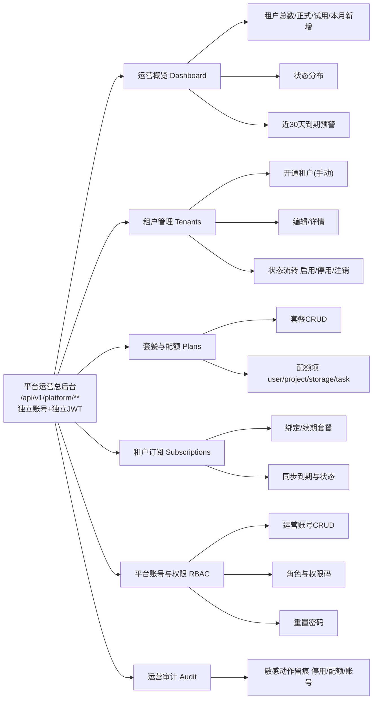
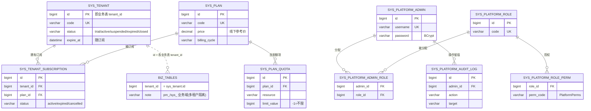

# 平台运营总后台（SaaS 商用底座）— 事实源

> 平台域（`server/module-platform`）是**跨租户的全局域**，承载 SaaS 商用底座：租户注册、套餐配额、订阅、平台账号 RBAC、运营审计。
> 其表**不带 `tenant_id`**、不参与多租户隔离（继承 `PlatformBaseEntity`、登记在 `MidoTenantLineHandler` 忽略名单）；
> 账号体系独立于任何租户，走 `/api/v1/platform/**` + 独立 JWT 密钥（`PlatformTokenService`）。详见 CLAUDE.md §4「平台域」。

## 1. 信息架构（一级域）

## 2. 数据模型（平台域 ER）

完整 DDL 见 `docs/data-model.md`「平台域」段与 `V27/V28` migration。

## 3. 接口一览（前缀 `/api/v1/platform`）

| 域 | 方法 路径 | 权限码 |
|---|---|---|
| 认证 | POST `/auth/login`、GET `/auth/me` | 放行 / 登录态 |
| 概览 | GET `/dashboard/overview` | `platform:dashboard:view` |
| 租户 | POST `/tenants/query`、GET `/tenants/{id}` | `platform:tenant:query` |
| 租户 | POST `/tenants`、PUT `/tenants/{id}`、PUT `/tenants/{id}/status` | `platform:tenant:manage` |
| 订阅 | POST `/tenants/{id}/subscription` | `platform:subscription:manage` |
| 套餐 | GET `/plans`、GET `/plans/{id}` | `platform:plan:query` |
| 套餐 | POST/PUT/DELETE `/plans` | `platform:plan:manage` |
| 账号 | GET `/admins`、GET `/roles` | `platform:admin:query` |
| 账号 | POST `/admins`、PUT `/admins/{id}`、PUT `/admins/{id}/password` | `platform:admin:manage` |
| 审计 | POST `/audit/query` | `platform:audit:query` |

## 4. 关键设计约束

- **租户生命周期**：`trial`(开通即试用) → 绑定订阅转 `active` → `suspended`(停用) / `closed`(注销)；`expired` 预留给到期自动流转（P1 定时任务）。
- **订阅不变量**：每租户至多一条 `active` 订阅；绑定新订阅时旧 active 置 `cancelled`，并同步租户 `expire_at`/`status`/首次 `activated_at`。
- **自用租户**：`sys_tenant.id=1`（与业务侧固定 `tenant_id=1` 对齐），内置订阅旗舰版、不限期。
- **种子账号**：平台超管 `superadmin / superadmin123`（BCrypt；生产必须改密码并覆盖 `MIDO_PLATFORM_JWT_SECRET`）。
- **计费**：阶段一**线下收款**，`price` 仅作参考价，不接支付网关。

## 5. P1 能力（已交付）

- **多租户登录隔离**：租户侧从固定 `tenant_id=1` 切换为按 JWT 真实租户解析（`TenantContextFilter` 设基线，`JwtAuthenticationFilter` 按令牌租户声明覆盖）。每租户独立用户命名空间（`uk_user_tenant_phone`），登录按租户编码 + 账号定位（`tenantCode` 缺省回落自用租户）。
- **用量统计**：`UsageContributor` 端口由各业务域实现（user/project/task/storage_mb），平台 `PlatformUsageService` 经 `PlatformTenantScope` 切租户聚合，每日定时快照（`PlatformUsageScheduler`，cron 可配）+ 手动触发；运营台「用量 vs 配额」展示与超限标记。
- **配额强制**：`QuotaGuard` 端口（平台实现，读当前租户生效订阅配额），建成员/项目时硬校验超限拦截；task/storage 当前仅统计预警不硬卡。
- **模拟登录**：运营经 `POST /platform/tenants/{id}/impersonate` 以租户主用户身份签发**短时**租户令牌（默认 30min，携带 `imp` 声明），完整权限、全程审计。

> 端口均落在 `common`（`TenantDirectory`/`TenantUserLocator`/`QuotaGuard`/`UsageContributor`），实现分散在 platform/org/project/task/doc，保持模块无环（业务域不反向依赖 platform）。

## 6. P2.1 能力（已交付）

- **线下收入台账**：`sys_revenue_record` 流水 CRUD + 汇总（收款/退款/净额），运营台「收入台账」页。
- **公告下发**：`sys_announcement` 运营建/发布；租户侧 `GET /api/v1/announcements` 读当前生效公告（走租户链），前端顶栏公告入口展示。
- **功能开关按套餐下发**：`sys_plan_feature` 配 plan→功能码（FeatureCodes：gantt/okr/npss/doc/cost/report/change/openapi）；租户侧 `GET /api/v1/features` 取启用项做前端门控（未订阅/未配置 fail-open 全启用）。
- **模拟登录只读**：令牌 `imp` 声明经 `CurrentUser.impersonatedBy` 透传，`ImpersonationReadOnlyInterceptor` 拦截模拟态下的写操作（仅放行 GET/HEAD/OPTIONS）——收敛了 P1 的完整权限模拟。

## 7. 路线图（P2.2，下一批）

- **开放平台 API Key**：key 绑定用户、可访问全量 `/api/v1`（按该用户权限/数据范围），独立 ApiKey 鉴权过滤器。
- **数据导出/注销合规**：注销发起→标记 closed→记录计划清除时间（默认 30 天）→定时清除；核心域（项目/任务/成员/目标）异步 JSON 导出打包。
- 工单客服、合同台账报表等运营增强。
