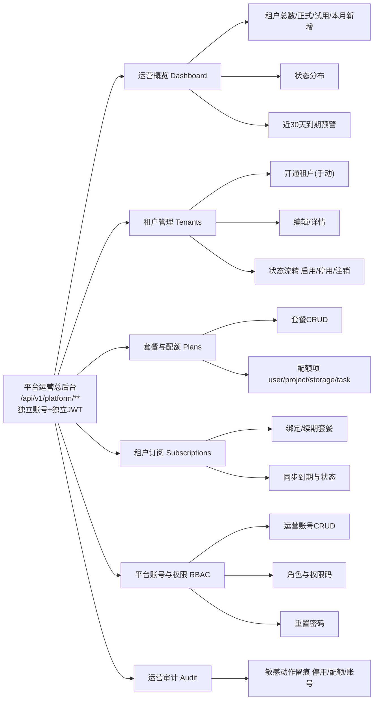
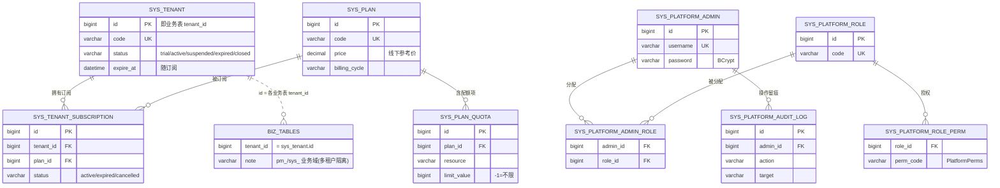

# 平台运营总后台（SaaS 商用底座）— 事实源

> 平台域（`server/module-platform`）是**跨租户的全局域**，承载 SaaS 商用底座：租户注册、套餐配额、订阅、平台账号 RBAC、运营审计。
> 其表**不带 `tenant_id`**、不参与多租户隔离（继承 `PlatformBaseEntity`、登记在 `MidoTenantLineHandler` 忽略名单）；
> 账号体系独立于任何租户，走 `/api/v1/platform/**` + 独立 JWT 密钥（`PlatformTokenService`）。详见 CLAUDE.md §4「平台域」。

## 1. 信息架构（一级域）

## 2. 数据模型（平台域 ER）

完整 DDL 见 `docs/data-model.md`「平台域」段与 `V27/V28` migration。

## 3. 接口一览（前缀 `/api/v1/platform`）

| 域 | 方法 路径 | 权限码 |
|---|---|---|
| 认证 | POST `/auth/login`、GET `/auth/me` | 放行 / 登录态 |
| 概览 | GET `/dashboard/overview` | `platform:dashboard:view` |
| 租户 | POST `/tenants/query`、GET `/tenants/{id}` | `platform:tenant:query` |
| 租户 | POST `/tenants`、PUT `/tenants/{id}`、PUT `/tenants/{id}/status` | `platform:tenant:manage` |
| 订阅 | POST `/tenants/{id}/subscription` | `platform:subscription:manage` |
| 套餐 | GET `/plans`、GET `/plans/{id}` | `platform:plan:query` |
| 套餐 | POST/PUT/DELETE `/plans` | `platform:plan:manage` |
| 账号 | GET `/admins`、GET `/roles` | `platform:admin:query` |
| 账号 | POST `/admins`、PUT `/admins/{id}`、PUT `/admins/{id}/password` | `platform:admin:manage` |
| 审计 | POST `/audit/query` | `platform:audit:query` |

## 4. 关键设计约束

- **租户生命周期**：`trial`(开通即试用) → 绑定订阅转 `active` → `suspended`(停用) / `closed`(注销)；`expired` 预留给到期自动流转（P1 定时任务）。
- **订阅不变量**：每租户至多一条 `active` 订阅；绑定新订阅时旧 active 置 `cancelled`，并同步租户 `expire_at`/`status`/首次 `activated_at`。
- **自用租户**：`sys_tenant.id=1`（与业务侧固定 `tenant_id=1` 对齐），内置订阅旗舰版、不限期。
- **种子账号**：平台超管 `superadmin / superadmin123`（BCrypt；生产必须改密码并覆盖 `MIDO_PLATFORM_JWT_SECRET`）。
- **计费**：阶段一**线下收款**，`price` 仅作参考价，不接支付网关。

## 5. 路线图

- **P0（本期已交付）**：平台域建模 + 独立认证 + 租户管理 + 套餐配额 + 订阅 + 运营概览 + 平台 RBAC + 运营审计 + 独立运营台前端。
- **P1**：用量统计（定时快照 user/project/storage/task）+ 配额强制校验 + **租户侧从 JWT 解析真实 `tenant_id` 替换固定值、多租户登录隔离打通（全模块回归）** + 模拟登录 impersonation。
- **P2**：公告/通知模板、按套餐下发功能开关、工单客服、开放平台 API Key、数据导出/注销合规、线下收入/合同台账报表。
